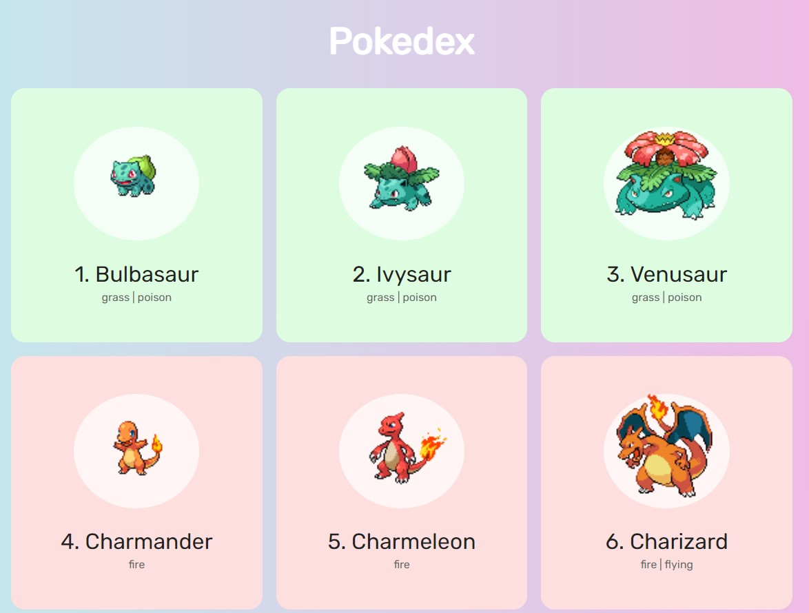

<h1 align="center"> Pokedex Pokémon </h1>

Projeto realizado para estudar consumo de API criando uma pokedex com os 150 pokémons iniciais.   

  <a href="#-tecnologias">Tecnologias</a>&nbsp;&nbsp;&nbsp;|&nbsp;&nbsp;&nbsp;
  <a href="#-projeto">Projeto</a>&nbsp;&nbsp;&nbsp;|&nbsp;&nbsp;&nbsp;

 

  

## 🚀 Tecnologias

Esse projeto foi desenvolvido com as seguintes tecnologias:

- HTML e CSS
- JavaScript
- Git e Github
- Consumo de API

## 💻 Projeto

O Pokedex pokémon é um projeto feito para mostrar os 150 pokémons iniciais e seus tipos.

- [Visite o projeto online](https://guilhermedefferreira.github.io/pokedex-js-vanilla/)

---